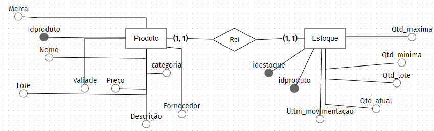
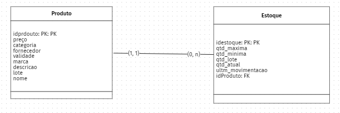
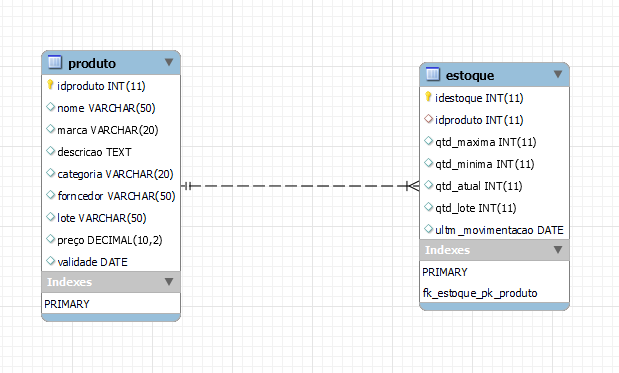

# Estudo de caso
Casa Oliveira

Roberto é dono de um mercado no bairro de Vargem Grande, na cidade de Tupã. Ele herdou o negócio de seu pai, Gumercindo Oliveira, ela foi aberta em 1978 na garagem da casa da família, era uma pequena quitanda. Com o passar dos anos o negócio cresceu e Gumercindo foi obrigado a ir para outro ponto maior e ali permaneceu até os dias atuais.

Roberto, que agora é o novo dono do mercado continuou o negócio seguindo da mesma forma que o pai. Ele comprava diretamente com os fornecedores grandes volumes de produtos e armazenava em seu estoque. As vezes ele comprava muitos produtos que ainda havia em estoque causando uma sobrecarga de produtos, ele também tinha muitos produtos estragados, tais como: frutas, legumes, iogurtes, leites, frango, etc. Também havia muitos produtos com o prazo de validade vencido.

Os funcionários eram poucos e faziam muitas coisas ao mesmo tempo. O açougueiro também ajudava no estoque, a moça da limpeza ajudava na organização dos produtos das prateleira, além de ajudar na padaria, quanto o caixa estava vazio o operador ajudava a repor os laticínios e a limpar a loja. O repositor também fazia operação no caixa.

Ao realizar a venda o Roberto, que sabia o nome de quase todos os clientes, anotava em um caderno todos os produtos que vendia e que havia em estoque. Ao fim do dia , Roberto pegava o caderno de fazia os cálculos de o quanto havia vendido, somando o faturamento e realizando a atualização do estoque. Isso é feito todos os dias e tomava um tempo considerável para que tudo tenha sido feito.

Roberto fechava a loja as 18h, mas só ia para casa as 22h, após fazer todas as operações necessárias. Mesmo assim o negócio vai bem e Roberto pretende ir para outro ponto e aumentar o volume de negócios e contratar novos funcionários.

Marica, esposa de Roberto, vem conversando com ele há muito tempo para que ele contrate uma empresa para construir um sistema de informática para gerenciar o negócio e reduzir o tempo que ele passa trabalhando e tenha maior organização dos produtos, maior lucratividade e melhorar a gestão.

Com a intenção de aumentar o negócio, Roberto está disposto a informatizar sua empresa. Vamos ajudá-lo. Iremos começar construindo o banco de dados.

---

## Problemas a se solucionar:
+	Gerenciamento do estoque: (Saída do estoque)
	Falta de funcionários
	Funcionário desempenhando
+   Fluxo de caixa: (Entrada |saída de valores)
	Gestão do patrimônio: Computadores, prateleiras, Geladeiras, Forno, Carinhos, Caixas, Balcões padaria e açougue, balanças e etc..  
	Setor Financeiro e compras

Gestão do Estoque  
- Informações sobre os produtos: (validades, valor, lote, descrição, marca, nome, idproduto, categoria, fornecedor)
- Volume de produtos em estoque: (quantidades_atual, quatidade_lote, ultima_movimentação, quatidade_maxima, quatidade_minima)

Gestão de funcionários 
- Informações dos funcionários: (Nome, função| cargo, salario, matricula, cpf, rg, telefone, e-mail, estado civil data de admissão, data de nascimento, endereço, usuários, senha e id)
-Fluxo de caixa: (forma_pagamento, limite_sagria, valor, entrada | saída, resgistro_venda)

Gestão de Patrimônio
- Informação_patrimônio (idpatrimonio, codigo_patrimonio, descrição, valor, nome, setor_pertencente, data_aquisicao, setor_responsável, data_baixa)

Setor compras
- Informação_compras (idcompras, funcionários, valor_pag_produto,fornecedor, data_compra, numero_nota_fiscal, nome_produto, descrição, consumível, quatidades, setor_destino)

Setor Financeiro
- Informacao_finaceiro (idfinaciero, despesas, lucro, disponibilidade_cofre, valor, tipo_valor, descrição, data_operação, indetificação_responsavel)  

### Modelo conceitual



---

### Modelo Lógico



---

## Código do  SQL

Para o projeto de banco de dados da casa Oliveira será criado uma estrutura física com os comados SQL (Sructure Query Language). Iremos começar com o comando de criação de dados. Este comando pertece a categoria de comandos DDL(Data Definition Language)
<br>
Comado:
<br>
 CREATE DATABASE nome_do_banco -> CREATE DATABASE casaoliveira


><pre><code>CREATE DATABASE casaoliveira;</pre></code>

Após a criação do banco de dados, é necessários selecioná-lo. Para isso iremos usar o comando USE nome_banco_de_dados

><pre><code>USE casaoliveira;</pre></code>


Criação das entidades em modo físico usando o comando SQL. Para criar uma tabela (entidade) usaremos o comando CREATE TABLE nome_tabela seguido por parenteses e os atritubos(campos)da tabela, bem como a sua tipificação, ou seja, devemos dizer qual o tipo de dados que cada campo(atributo) da tabela deve receber. Ex: o campo idade deve receber valores numéricos e,portanto será definido como int(inteiro). 

Vamso criar a tabela de produtos. Esta tabela possui os seguintes campos:
<br>
		- idproduto, descricao, fornecedor, validade,lote, preco,nome, marca, categoria, Para cada será definido um tipo de dado para o idproduto como:
		- Chave primária (Primary Key) é nosso campo indexador, por ele será realizando o relacionamento com outras tabelas;
		<br><br>
        - Vamos definir este campo com auto_incremente, o que permite gerar ids os de forma automáticas. Esse passo é importe, pois elemina algums problemas, tais como: Concorrência,geração incrementada de valores e exclusividadede valores;
		<br><br>
        - Vamos definir o campo o tipo de dado numéricos int(inteiro).
		<br><br>
        - Para o campo de descrição, usaremos o tipo de dado Text. Com este tipo podemos inserir até 64mil caracteres. Como neste campo pode haver a possibilidade de uma descrição longa do produto, se faz necessários uma tamanho maior.
		<br>
        - Para o campo fornecedor iremos usar tipo de dado VARHAR. este tipo de dados nos permite inserir textos, mas com um limite que pode ser pré-definido pelo usuários ou podemosutilizar o limite total de 225 caracteres. Para o forncedor, usaremos 50 caracteres.
		<br>
        - Para o campo validade iremos utilizar o tipo de dado DATE. Este tipo de dados permite colocar data.
		<br>
		- Para o campo lote será definido o VARCHAR, pois há a possibilidade de valor conter caracteres alfanumericos. Sendo assim, o VARCHAR é uma ótima opção por aceitar valores diversos.
		<br><br>
        - O campo preço será definido como DECIMAL. Com este tipo é possível inserir valores númericos com a aplicação de casas decimais. Você definie o comprimento e deste tamanho
        é configurado as casa decimais. EX: DECIMAL(10,2) -> Comprimento de 10 digitos e deste temos 2 casas decimais
		<br>
Veja: R$ 1111111111.22 -> R$ 1111111111,22
<br> <br>
        - Para os campos nomes, marcas e categoria será definido o tipo de dados VARCHAR, pois esse tipo é capaz de receber caracateres de texto. Presaremos, apenas definir, o tamanho de cada campo.
		<br>
EX: nome pode ficar com o tamnho 50, marca ficar com 30 e categoria 20

```
CREATE TABLE produto (
	idproduto INT auto_increment primary key, 
	nome VARCHAR(50), 
	marca VARCHAR(20), 
	descricao text, 
	categoria VARCHAR(20), 
	forncedor VARCHAR(50), 
	lote VARCHAR(50), 
	preço DECIMAL(10,2), 
	validade DATE);
```
```
CREATE TABLE estoque(
	idestoque INT auto_increment primary key, 
	idproduto INT , 
	qtd_maxima INT, 
	qtd_minima INT, 
	qtd_atual INT, 
	qtd_lote INT, 
	ultm_movimentacao DATE);
```
---
### Modelo físico -MER(Modelo de Entidade Relacional)
<br>

