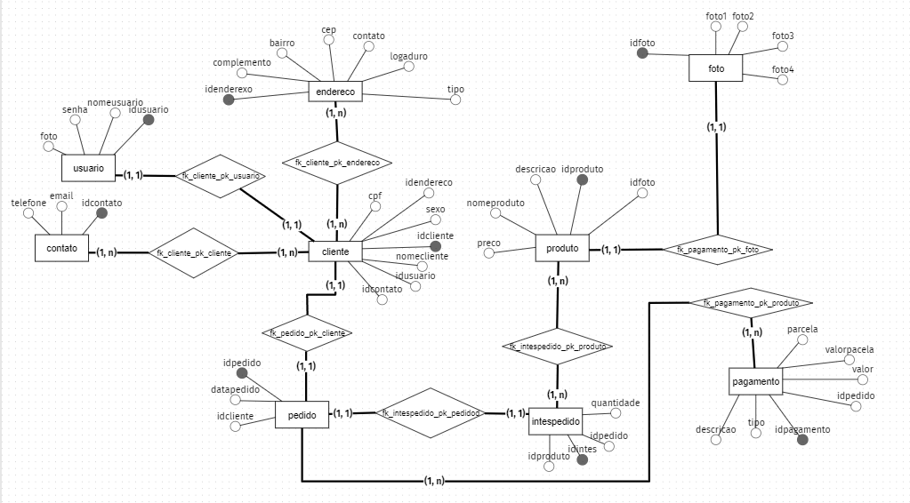

# Estudo-Caso-Kibaratu

 Nese caso você encontrar como monta um banco de dados via uma loja de eletrônico fictício que gostaria de armazenar informações referentes aos seus clientes, compras, produtos e pagamento. Para fazer o gerenciamento de dados de modo que garante a proteção das informações armazenadas e privacidade das informações.  

---
## Modelo conceitual
<br>
Em resumo, modelos de dados conceituais são diagramas de alto nível que representam os conceitos de dados que suportam o negócio de uma empresa, uma área de negócio ou, por exemplo, um sistema de informações.

A técnica para construção de um Modelo Conceitual de Dados é simples. O processo envolver conhecer os mecanismos de abstração utilizados e ter habilidade específica 
para extrair e entender a visão de negócio do assunto em questão.

### Com base no cenário criando, o cliente pediu devemos criar as seguintes tabelas:
- Usuário
- Endereço
- Contato
- Cliente
- Produto
- Pagamento
- Itens pedidos
- Fotos

Com isso devemos criar o modelo conceitual assim:



---

### Modelo Lógico
<br>
O modelo lógico é um tipo de modelo de dados que descreve elementos de dados em detalhes, sendo usado para desenvolver entendimentos visuais de entidades de dados, atributos, chaves e relacionamentos. Este tipo de modelo estabelecer uma estrutura definida para componentes da camada semântica em sistemas de gerenciamento de dados.

Com isso devemos criar o modelo lógico assim:


---
## Esquema do Banco de dados no Excel
Também foi criando nesse projeto um modelo no Excel para compreender melhor o modelo lógico.


 ---
## Modelo físico -MER(Modelo de Entidade Relacional)
<br>
Descreve, por meio de alguma linguagem, como será feita a armazenagem no banco. Nesse nível se escolhe qual Sistema gerenciador de Banco de dados (SGBD) será usado, considerando o modelo lógico adotado.

Para começar o modelo físico do projeto de banco de dados da casa Kibaratu será criado uma estrutura física com os comados SQL (Sructure Query Language). Iremos começar com o comando de criação de dados. Este comando pertence à categoria de comandos DDL(Data Definition Language)

Comado: CREATE DATABASE nome_do_banco -> CREATE DATABASE kibaratu


><pre><code>CREATE DATABASE kibaratu;</pre></code>

Após a criação do banco de dados, é necessários selecioná-lo. Para isso iremos usar o comando USE nome_banco_de_dados

><pre><code>USE kibaratu;</pre></code>

Para criar as tabelas, iremos utilizar o comando DDL(DATA DEFINITION LANGUAGE) chamado
CREATE TABLE nome_da_tabela e utilizaremos campos e cada campos será definido um tipo de dado como INT, DECIMAL, VARCHAR, TEXT, ENUM, TIMESTAMP e UNIQUE

``` 
CREATE TABLE usuario(
	idusuario int auto_increment primary key,
	nomeusuario varchar(50) not null unique,
	senha varchar(255) not null
);
 
CREATE TABLE endereco(
	idendereco int auto_increment primary key,
	tipo enum("Rua","Avenida","Alameda","Travessa","Viela","Praça","Estrada"),
	logradouro varchar(100) not null,
	numero varchar(10) not null,
	complemento varchar(20),
	bairro varchar(20) not null,
	cep varchar(10) not null
);
 
CREATE TABLE contato(
	idcontato int auto_increment primary key,
	email varchar(100) not null unique,
	telefone varchar(15) not null
);

CREATE TABLE cliente(
	idcliente int auto_increment primary key,
	nomecliente varchar(100) not null,
	cpf varchar(15) not null unique,
	sexo enum("Masculino","Feminino","Outros"),
	idcontato int not null,
	idendereco int not null,
	idusuario int not null
);

CREATE TABLE produto(
	idproduto int auto_increment primary key,
	nomeproduto varchar(50) not null,
	descricao text not null,
	preco decimal(8,2) not null,
	idfoto int not null
);

CREATE TABLE foto(
	idfoto int auto_increment primary key,
	foto1 varchar(255) not null,
	foto2 varchar(255),
	foto3 varchar(255),
	foto4 varchar(255)
);

CREATE TABLE pedido(
	idpedido int auto_increment primary key,
    idcliente int not null,
    datapedido timestamp default current_timestamp()
);

CREATE TABLE itenspedido (
	iditnespedido int auto_increment primary key,
    idpedido int not null,
    idproduto int not null,
    quantidade int not null default 1 
);

CREATE TABLE pagamento(
	idpagamento int auto_increment primary key,
    idpedido int not null,
    tipo enum ("Crédito","Débito","Boleto","Transferência bancária","Pix") not null,
    descricao text not null,
    valor decimal (8,2) not null,
	parcela int not null default 1 ,
    valorparcela decimal (8,2) not null
);
``` 
---

## Relacionamento da chave estrageira
<br>
Os relacionamentos de banco de dados são associações entre tabelas que são criadas usando instruções de junção para recuperar dados. A tabela a seguir descreve os relacionamentos do banco de dados. Ambas tabelas podem ter somente um registro de cada lado do relacionamento.

 Ao Estabelecer o relacionamento ebtres as tableas cliente e cotanto, usuário e endereço
Vamos usar um comando DDL (data definition language) que permite altera a estrutura da tabela 

 Neste caso iremos aplicar um relacionamento entres as tabelas cliente e contato

``` 
ALTER TABLE `cliente`  
ADD CONSTRAINT `fk_clinte_pk_contato`
FOREIGN KEY (`idcontato`) 
REFERENCES `contato` (`idcontato`);
``` 
Relacionamento entre cliente e usuario
``` 
ALTER TABLE `cliente`  
ADD CONSTRAINT `fk_clinte_pk_usuario`
FOREIGN KEY (`idusuario`) 
REFERENCES `usuario` (`idusuario`);
``` 

Relacionamento entre cliente e endereço
``` 
ALTER TABLE `cliente`  
ADD CONSTRAINT `fk_clinte_pk_endereco`
FOREIGN KEY (`idendereco`) 
REFERENCES `endereco` (`idendereco`);
``` 
Relacionamento entre produto e foto
``` 
ALTER TABLE `produto`  
ADD CONSTRAINT `fk_produto_pk_foto`
FOREIGN KEY (`idfoto`) 
REFERENCES `foto` (`idfoto`);
``` 
Relacionamento entre pedido e cliente
``` 
ALTER TABLE `pedido`  
ADD CONSTRAINT `fk_pedido_pk_cliente`
FOREIGN KEY (`idcliente`) 
REFERENCES `cliente` (`idcliente`);
``` 
Relacionamento entre itenspedido e pedido
``` 
ALTER TABLE `itenspedido`  
ADD CONSTRAINT `fk_itenspedido_pk_pedido`
FOREIGN KEY (`idpedido`) 
REFERENCES `pedido` (`idpedido`);
``` 
Relacionamento entre itenspedido e produto
``` 
ALTER TABLE `itenspedido`  
ADD CONSTRAINT `fk_itenspedido_pk_produto`
FOREIGN KEY (`idproduto`) 
REFERENCES `produto` (`idproduto`);
``` 

Relacionamento entre pagamento e pedido
``` 
ALTER TABLE `pagamento`  
ADD CONSTRAINT `fk_pagamento_pk_pedido`
FOREIGN KEY (`idpedido`) 
REFERENCES `pedido` (`idpedido`);
``` 

---

### Modelo físico -MER(Modelo de Entidade Relacional)
<br>
O MER (Modelo Entidade Relacionamento) é utilizado para descrever os objetos do mundo real através de entidades, com suas propriedades que são os atributos e os seus relacionamentos.
<br>


Esse modelo foi criando pelo Mysql Workgorup

---
## Manipulação de dados
Para selecionar os dados da tabela usuarios com o comado select exemplo:
<pre><code>SELECT * FROM usuario;</code></pre>
Comando para inserir dados na tabela. Usaremos o comando INSERT exemplo:
<pre><code>INSERT INTO usuario (nomeusuario,senha) VALUES("isack",sha("123"));</pre></code>
exemplo:


Para atualizar os dados de uma tabela, você usar o comando update e não pode esquecer de informa o ID que deseja modificar 

<pre><code>UPDATE usuario SET senha=sha("1234") WHERE idusuario = 1;</pre></code>

Vamos cadastrar um novo usuario
<pre><code>INSERT INTO usuario (nomeusuario, senha) VALUES ("Roberto",sha("123456"));</pre></code>

Para apagar um tupla(linha de registro) você deve usar o comando DELETE e não esquecer de informar o ID 
<pre><code>DELETE FROM usuario WHERE idusuario =2;</pre></code>

---

